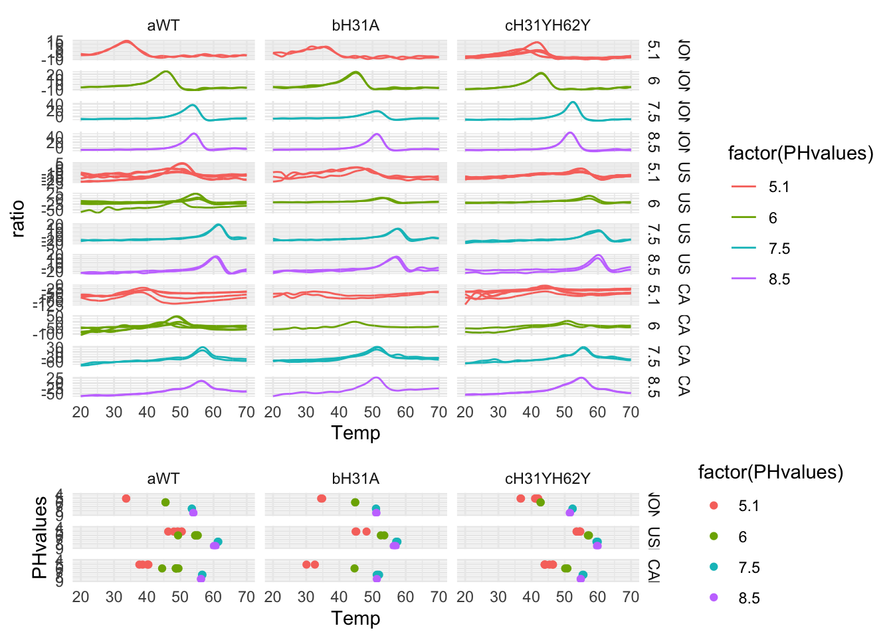
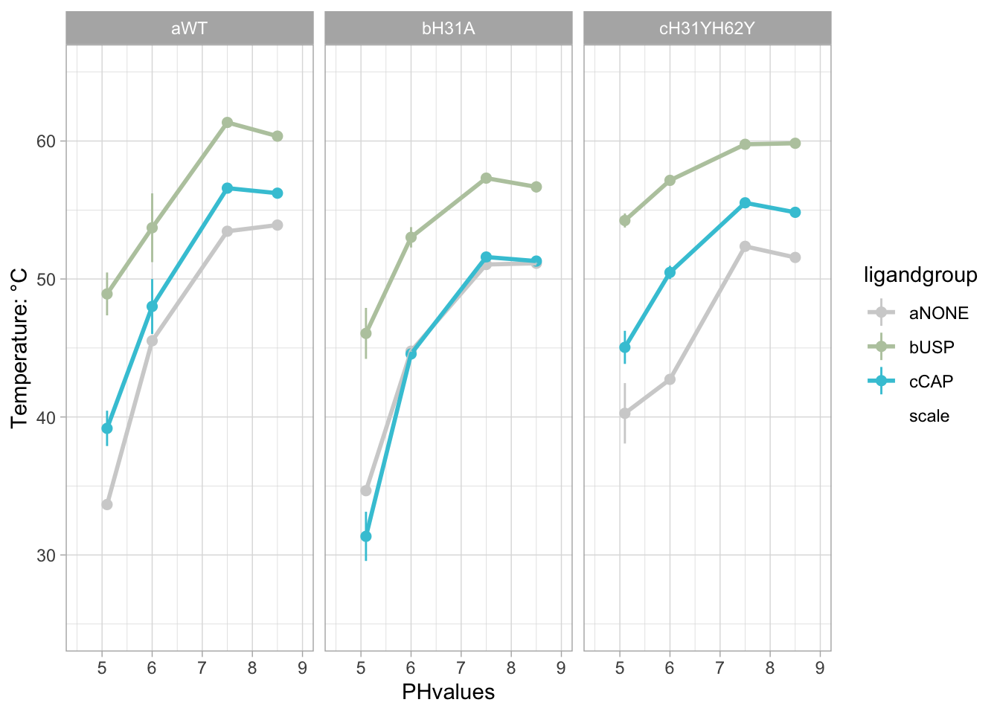
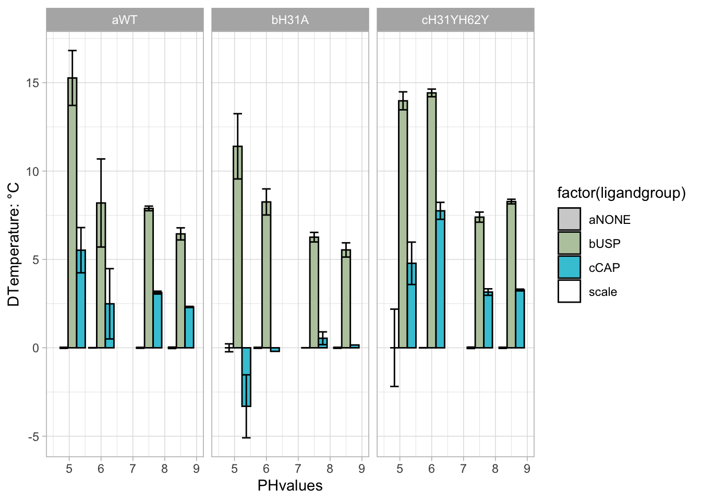
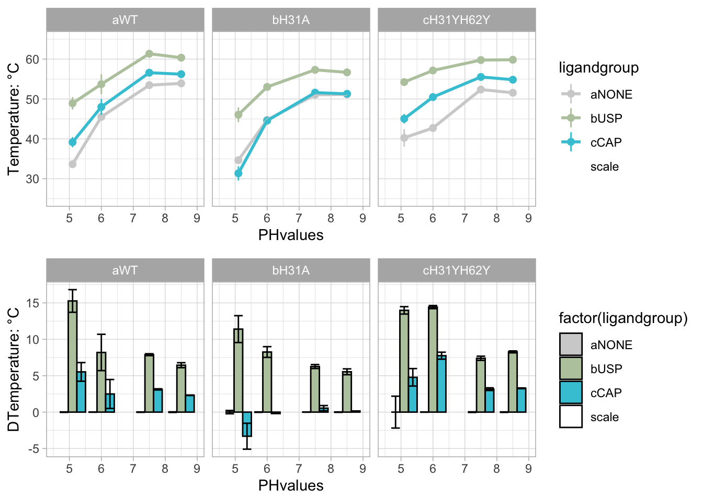
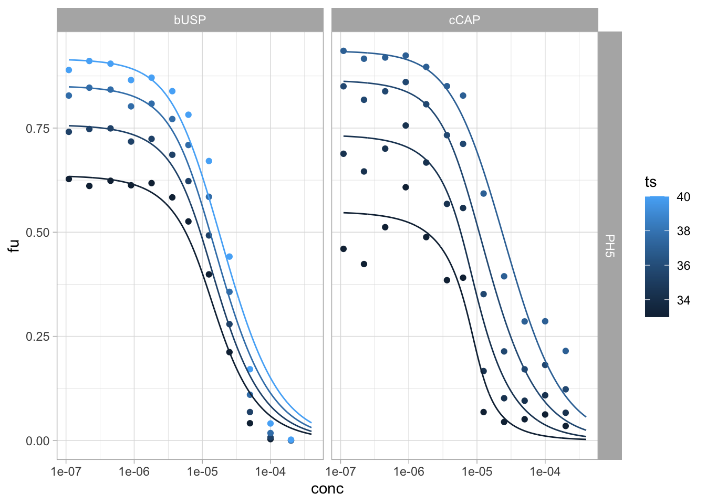
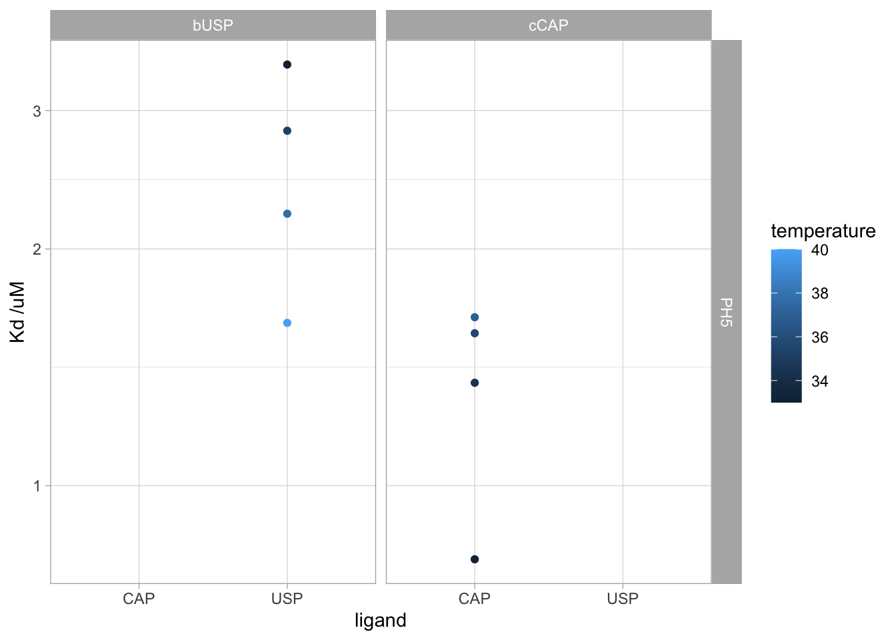
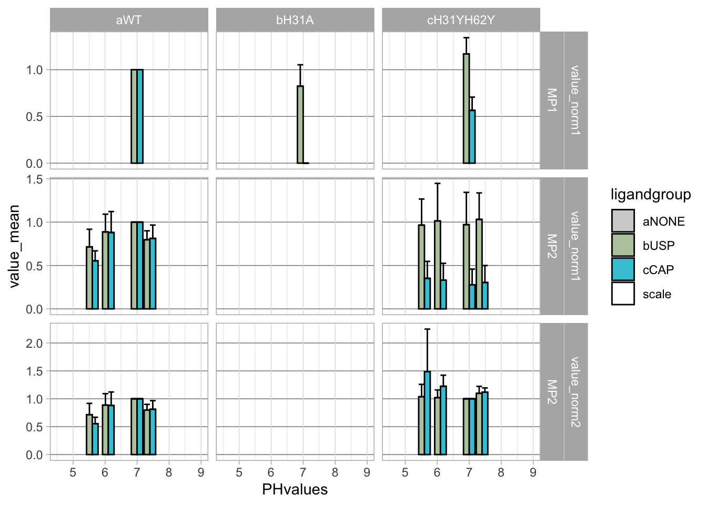

# Info


```r
library(ggplot2)
library(tidyverse)
library(plyr)
library(tidyr)
library(stringr)
library(ggforce)
library(readr)
library(ggsci)
library(knitr)
library(bookdown)
library(tinytex)
library(kableExtra)
library(DT)
library(xfun)
library(readxl)
library(vroom)
library(metR)
library(reshape2)
library(misc3d)
library(ggforce)
library(RColorBrewer)
library(ggpubr)
library(bsts)
library(prospectr)
library(ggridges)
library(svglite)
library(plotly)
library(rstatix)
```
nanoDSF Data and immunoprecipitation data as Supplemental data on [DRYAD](https://doi.org/10.5061/dryad.k98sf7mb8). 

NanoDSF data were collected as described in the methods section of the [associated manuscript](to be linked). Data were analyzed using the Prometheus [software](https://nanotempertech.com/prometheus-software/). The preprocessed data are availabe in the associated data folders. This script was only used to import and tidy the data to generate the plots.

# Analysis of Prometheus stability pH data

## Data import

```r
paste_names_f <-  function(paste1, paste2){
  character_out <- paste("[^(^", paste1, paste2, "$)]", sep = "")
  return(character_out)
}

unlist_PH_string_f <- function(PHlist){
  PHstring <- PHlist %>% unlist() %>% as_tibble() %>% dplyr::mutate(., name = paste("character", row_number(), sep = "")) %>% pivot_wider(., names_from = name, values_from = value) %>% unite("character", contains("character"), sep = "") %>% pull()
  return(PHstring)
}

str_replace_all_f <- function(string, pattern){
  string_out <- str_replace_all(string, pattern, "")
return(string_out)
}

addcolumn_f <- function(data, column){
  data_out <- data %>% add_column(., column)
  return(data_out)
}

ratio_length_f <- function(df){
  value_out <- length(df) %>% na_if(0)
  return(value_out)
}

plotname_f <- function(collection, id){
  name_out <- paste("./plots_", collection, "/plot", id, ".jpeg", sep ="" )
  return(name_out)
}

plot_derivative_f <- function(data, ip1, ip2, ip3, ip4, ip5, ip6){
  ip_tibble <- as_tibble(c(ip1, ip2, ip3, ip4, ip5, ip6)) %>% dplyr::mutate(., ip = row_number())
  plot_out <- ggplot() +geom_line(data = data,aes(x=Temp, y=ratio)) + geom_vline(data = ip_tibble, aes(xintercept = value, colour = as_factor(ip))) + theme_minimal() 
  return(plot_out)
}

rawplotname_f <- function(collection, id){
  name_out <- paste("./rawplots_", collection, "/rawplot", id, ".jpeg", sep ="" )
  return(name_out)
}


PHvalues <- tribble(~PHstring, ~PHvalues,
                    c("_PH74__", "_PH50__", "_PH60__", "_PH51__", "5", "6", "7.5", "8.5", " 7.5to5", " 6to5", "2_ph5", "2_ph6", " 5", "  5", "PH56","PH50", "PH61", "PH74"),
                    c(7.5, 5.1, 6, 5.1, 5.1, 6, 7.5, 8.5, 5.1, 5.1, 5.1, 6, 5.1, 5.1, 5.6, 5.1, 6, 7.5))

PHvalues <- PHvalues %>% unnest(., cols = c("PHstring", "PHvalues"))

promethues_list = list.files(path = "./data_prometheus", pattern = "*", recursive = TRUE, include.dirs = TRUE, full.names = TRUE)
promethues_list.tib <- as_tibble(promethues_list)

prometheus_coladd <- tribble(~filtername, ~datasetid, ~range, ~colnames, ~collection,
                          "202008xNTF2xPHxPROCx330nm.xlsx", 1, "A2:J9", c("capillary", "sampleID", "power", "Tstart", "Tend", "Tslope", "Start", "duration", "onset", "ip1"), "TS1",
                          "202009xNTF2xUSPCAPxPHxH31AxPROCESSEDx330nm.xlsx", 1, "A2:J42", c("capillary", "sampleID", "power", "Tstart", "Tend", "Tslope", "Start", "duration", "ip1", "ip2"), "TS1",
                          "202009xNTF2xUSPCAPxPHx01xPROCESSEDx330nm.xlsx", 1, "A2:J49", c("capillary", "sampleID", "power", "Tstart", "Tend", "Tslope", "Start", "duration", "ip1", "ip2"), "TS2",
                          "20220407xNTF2xUSPCAPxPROCESSEDx330nm.xlsx", 1, "A2:N47", c("capillary", "sampleID", "power", "Tstart", "Tend", "Tslope", "Start", "duration", "ip1", "ip2","ip3", "ip4","ip5", "ip6"), "XH1",
                          "20220408xNTF2YYxUSPCAPxPROCESSEDx330nm.xlsx", 1, "A2:N43", c("capillary", "sampleID", "power", "Tstart", "Tend", "Tslope", "Start", "duration", "ip1", "ip2","ip3", "ip4","ip5", "ip6"), "XH1",
                           "20220409xNTF2YYxPROCESSEDx330nm.xlsx", 1, "A2:L11", c("capillary", "sampleID", "power", "Tstart", "Tend", "Tslope", "Start", "duration", "ip1", "ip2","ip3", "ip4"), "XH1", 
                          "20220429_CAP_TITRATION_330PROCESSED.xlsx", 1, "A2:L49", c("capillary", "sampleID", "power", "Tstart", "Tend", "Tslope", "Start", "duration", "ip1", "ip2","ip3", "ip4"), "XH2",
                          "20220429_USP_TITRATION_330PROCESSED.xlsx", 1, "A2:L49", c("capillary", "sampleID", "power", "Tstart", "Tend", "Tslope", "Start", "duration", "ip1", "ip2","ip3", "ip4"), "XH2", 
)

filter_files <- prometheus_coladd %>% dplyr::select(., filtername) %>% dplyr::mutate(., id = row_number()) %>% dplyr::mutate(., idname = paste("filename", id, sep = "")) %>% dplyr::select(., -id) %>% pivot_wider(., names_from = c("idname"), values_from = "filtername") %>% unite(., string, everything(), sep ="|") %>% pull()

prometheus_data.tib <- promethues_list.tib %>% dplyr::mutate(., filterme = str_detect(value, filter_files), filtername = str_extract(value, filter_files)) %>% dplyr::filter(., filterme == TRUE) 


sort_names <- tribble(~collection, ~NTF2names, ~DMSO, ~Lignames,
                      "TS1", "NTF2|NTF|H31A|NONE", "D4", "CAP[:digit:][:digit:]|USP[:digit:][:digit:]|NONE",
                      "TS2", "NTF2|NTF|H31A|NONE", "D4", "CAP[:digit:][:digit:]|USP[:digit:][:digit:]|NONE",
                      "XH1", "NTF|YY|H31A", "D4", "CAP|USP",
                      "XH2", "NTF", "D4", "((CAP)(.){1,10})(?=(ph))|((USP)(.){1,10})(?=(ph))")

sort_names <- sort_names %>% dplyr::mutate(., selectpH = paste(NTF2names, DMSO,Lignames, sep = "|" ))

prometheus_coladd <- prometheus_coladd %>% left_join(., sort_names)

NTF2group_tib <- tribble(~NTF2, ~NTF2group,
                         "NTF2", "aWT",
                         "NTF", "aWT",
                         "H31A", "bH31A",
                         "YY", "cH31YH62Y",
                         "NONE", "dNONE")

ligandgroup_tib <- tribble(~ligandshort, ~ligandgroup,
                           "NONE", "aNONE",
                           "USP", "bUSP",
                           "CAP", "cCAP")

LIGcolor_scale <- tribble(~name, ~value, c( "aNONE", "bUSP", "cCAP", "scale"), c("#D1D1D1" ,"#B9C9AD","#3FC6D8", "#FFFFFF00")) %>% unnest(., name, value) %>% deframe()

concentrations_tib <- tribble(~conc_string, ~conc_uM,
                              c("", "01", "02", "03", "04", "05", "06", "07", "08", "09", "10", "11", "_200", "_100", "_50", "_25", "_12.5", "_6.25", "_3.625", "_1.8", "_0.9", "_0.45", "_0.225", "_0.11"),
                              c(200, (800/(2^seq(1,11,by=1))), (400/(2^seq(1,12,by=1)))))

concentrations_tib <- concentrations_tib %>% unnest(., cols = c("conc_string", "conc_uM"))

#sedphat_columns <- sedphat_columns %>% dplyr::mutate(., datasets_seq = purrr::map(datasets, ~seq_along_c(.))) %>% unnest(., cols = "datasets_seq") %>% left_join(., sedphat_coladd) %>% dplyr::select(., folder, datasetid = value, range, colnames)


prometheus_data.tib <- prometheus_data.tib %>% left_join(., prometheus_coladd) %>% dplyr::mutate(., data = purrr::pmap(list(value, datasetid, range, colnames), read_xlsx)) 

prometheus_data_ratio.pretib <- prometheus_data.tib %>% dplyr::select(., value, filtername, data, collection, NTF2names, Lignames, selectpH) %>% dplyr::mutate(., meas_type = str_extract(filtername, pattern = c("330"))) %>% unnest(., cols = c("data")) %>% drop_na(., capillary) %>% dplyr::mutate(., cap1 = case_when(capillary < 25 ~ capillary+2, TRUE ~ 1), cap2 = case_when(cap1 == 1 ~ capillary-24, TRUE ~ 27)) %>% dplyr::mutate(., letter1 = LETTERS[cap1], letter2 = LETTERS[cap2]) %>% unite(., "rangeletters", contains("letter"), sep = "", na.rm = TRUE) %>% dplyr::mutate(., range = paste(rangeletters, toString(4),":", rangeletters, toString(5000), sep = ""), sheet = 5, sheet_raw = 4) %>% dplyr::mutate(., wv330dev = purrr::pmap(list(value, sheet, range, c("ratio")), read_xlsx), Temp = purrr::pmap(list(value, sheet, "B4:B5000", c("Temp")), read_xlsx), wv330raw = purrr::pmap(list(value, sheet_raw, range, c("ratio")), read_xlsx)) %>% dplyr::mutate(., NTF2 = str_extract(sampleID, NTF2names), ligand = str_extract(sampleID, Lignames)) %>% dplyr::mutate(., NTF2Lig = purrr::pmap(list( NTF2, ligand), paste_names_f)) %>% unnest(., c("NTF2Lig")) %>% dplyr::mutate(., PHstring = purrr::pmap(list(sampleID, selectpH), str_replace_all_f ))  

prometheus_data_ratio.tib <- prometheus_data_ratio.pretib %>% replace_na(., list(ligand = "NONE")) %>% dplyr::mutate(., conc_string = str_replace_all(ligand, "USP|CAP|NONE", "")) %>% left_join(., concentrations_tib) %>% unnest(., PHstring) %>% left_join(., PHvalues) %>% left_join(., NTF2group_tib) %>% dplyr::mutate(., ligandshort = str_extract(ligand, "(USP)|(CAP)|(NONE)")) %>% left_join(., ligandgroup_tib)  %>% group_by(., collection) %>% dplyr::arrange(., NTF2group, ligandgroup, PHvalues, conc_uM) %>% dplyr::mutate(., rowid = row_number()) %>% ungroup() %>% dplyr::mutate(., plotname = purrr::pmap(list(collection, rowid), plotname_f), rawplotname = purrr::pmap(list(collection, rowid), rawplotname_f)) %>% dplyr::mutate(., data = purrr::pmap(list(Temp, wv330dev), addcolumn_f), data_raw = purrr::pmap(list(Temp, wv330raw), addcolumn_f)) %>% dplyr::mutate(., data_test = purrr::pmap(list(wv330dev), ratio_length_f)) %>% unnest(., data_test) %>% drop_na(., data_test) %>% dplyr::mutate(., dataplot = purrr::pmap(list(data, ip1, ip2, ip3, ip4, ip5, ip6), plot_derivative_f), rawdata_plot = purrr::pmap(list(data_raw, ip1, ip2, ip3, ip4, ip5, ip6), plot_derivative_f))
```

## pre-plots and analysis
Plotting all data in folders to confirm/reject Tm-values.\
In folders plots_TS1, plots_TS2, plots_XH1 and plots_XH2.\
this chunk is not run in Rmarkdown.


```r
plot_directories <- prometheus_data_ratio.tib %>% dplyr::select(contains("plotname")) %>% unnest(., everything()) %>% pivot_longer(., everything()) %>% separate(., value, into = c("dot", "folder", "plot"), sep ="/") %>% unite(., "foldername", c(dot, folder), sep = "/") %>% dplyr::select(., foldername) %>% unique() 

pwalk(list(plot_directories$foldername),dir.create)   
         
pwalk(list(prometheus_data_ratio.tib$plotname, prometheus_data_ratio.tib$dataplot), ggsave)
pwalk(list(prometheus_data_ratio.tib$rawplotname, prometheus_data_ratio.tib$rawdata_plot), ggsave)
```

here went through the plots in the folders and checked manually for the position with the help of plotly. Simply run in commandline in Rstudio.\
not run in Rmarkdown.


```r
prometheus_data_ratio.tib %>% dplyr::filter(., collection == "TS1", rowid == 1) %>% .$dataplot
ggplotly()
prometheus_data_ratio.tib %>% dplyr::filter(., collection == "TS1", rowid == 1) %>% dplyr::select(., capillary, filtername)
```


```r
ip_standard <- tribble(~collection, ~ip_standard,
                       "TS1", "ip1",
                       "TS2", "ip1",
                       "XH1", "ip1",
                       "XH2", "ip1")

ip_selected <- tribble(~collection, ~capillary, ~filtername, ~ip_selected,
                       "TS1", 1, "202008xNTF2xPHxPROCx330nm.xlsx", "ip7",
                       "TS1", 2, "202008xNTF2xPHxPROCx330nm.xlsx", "ip7",
                       "TS1", 3, "202008xNTF2xPHxPROCx330nm.xlsx", "ip7",
                       "TS1", 4, "202008xNTF2xPHxPROCx330nm.xlsx", "ip7",
                       "TS1", 5, "202008xNTF2xPHxPROCx330nm.xlsx", "ip7",
                       "TS1", 6, "202008xNTF2xPHxPROCx330nm.xlsx", "ip7",
                       "TS1", 7, "202008xNTF2xPHxPROCx330nm.xlsx", "ip7",
                       "TS2", 4, "202009xNTF2xUSPCAPxPHx01xPROCESSEDx330nm.xlsx", "ip7",
                       "XH1", 13, "20220408xNTF2YYxUSPCAPxPROCESSEDx330nm.xlsx", "ip3",
                       "XH1", 14, "20220408xNTF2YYxUSPCAPxPROCESSEDx330nm.xlsx", "ip3",
                       "XH1", 15, "20220408xNTF2YYxUSPCAPxPROCESSEDx330nm.xlsx", "ip3",
                       "XH1", 16, "20220408xNTF2YYxUSPCAPxPROCESSEDx330nm.xlsx", "ip3",
                       "XH1", 17, "20220408xNTF2YYxUSPCAPxPROCESSEDx330nm.xlsx", "ip3",
                       "XH1", 18, "20220408xNTF2YYxUSPCAPxPROCESSEDx330nm.xlsx", "ip3",
                       "XH1", 19, "20220408xNTF2YYxUSPCAPxPROCESSEDx330nm.xlsx", "ip3",
                       "XH1", 20, "20220408xNTF2YYxUSPCAPxPROCESSEDx330nm.xlsx", "ip3",
                       "XH1", 21, "20220408xNTF2YYxUSPCAPxPROCESSEDx330nm.xlsx", "ip3",
                       "XH1", 38, "20220408xNTF2YYxUSPCAPxPROCESSEDx330nm.xlsx", "ip7",
                       "XH1", 25, "20220407xNTF2xUSPCAPxPROCESSEDx330nm.xlsx", "ip7",
                       "XH1", 26, "20220407xNTF2xUSPCAPxPROCESSEDx330nm.xlsx", "ip7",
                       "XH1", 23, "20220408xNTF2YYxUSPCAPxPROCESSEDx330nm.xlsx", "ip3",
                       "XH1", 24, "20220408xNTF2YYxUSPCAPxPROCESSEDx330nm.xlsx", "ip3",
                       "XH1", 27, "20220407xNTF2xUSPCAPxPROCESSEDx330nm.xlsx", "ip3",
                       "XH1", 39, "20220408xNTF2YYxUSPCAPxPROCESSEDx330nm.xlsx", "ip7",
                       "XH1", 25, "20220408xNTF2YYxUSPCAPxPROCESSEDx330nm.xlsx", "ip7",
                       "XH1", 26, "20220408xNTF2YYxUSPCAPxPROCESSEDx330nm.xlsx", "ip3",
                       "XH1", 27, "20220408xNTF2YYxUSPCAPxPROCESSEDx330nm.xlsx", "ip3",
                       "XH1", 28, "20220408xNTF2YYxUSPCAPxPROCESSEDx330nm.xlsx", "ip3",
                       "XH1", 29, "20220408xNTF2YYxUSPCAPxPROCESSEDx330nm.xlsx", "ip3",
                       "XH1", 30, "20220408xNTF2YYxUSPCAPxPROCESSEDx330nm.xlsx", "ip3",
                       "XH1", 31, "20220408xNTF2YYxUSPCAPxPROCESSEDx330nm.xlsx", "ip3",
                       "XH1", 32, "20220408xNTF2YYxUSPCAPxPROCESSEDx330nm.xlsx", "ip3",
                       "XH1", 34, "20220407xNTF2xUSPCAPxPROCESSEDx330nm.xlsx", "ip7",
                       "XH1", 33, "20220408xNTF2YYxUSPCAPxPROCESSEDx330nm.xlsx", "ip3",
                       "XH1", 34, "20220408xNTF2YYxUSPCAPxPROCESSEDx330nm.xlsx", "ip3",
                       "XH1", 41, "20220407xNTF2xUSPCAPxPROCESSEDx330nm.xlsx", "ip2",
                       "XH1", 42, "20220407xNTF2xUSPCAPxPROCESSEDx330nm.xlsx", "ip3",
                       "XH1", 35, "20220408xNTF2YYxUSPCAPxPROCESSEDx330nm.xlsx", "ip7",
                       "XH1", 36, "20220408xNTF2YYxUSPCAPxPROCESSEDx330nm.xlsx", "ip7",
                       "XH1", 43, "20220407xNTF2xUSPCAPxPROCESSEDx330nm.xlsx", "ip7",
                       "XH1", 40, "20220408xNTF2YYxUSPCAPxPROCESSEDx330nm.xlsx", "ip7",
                       "XH1", 41, "20220408xNTF2YYxUSPCAPxPROCESSEDx330nm.xlsx", "ip3",
                       "XH1", 42, "20220408xNTF2YYxUSPCAPxPROCESSEDx330nm.xlsx", "ip3",
                       "XH1", 1, "20220408xNTF2YYxUSPCAPxPROCESSEDx330nm.xlsx", "ip3",
                       "XH1", 2, "20220408xNTF2YYxUSPCAPxPROCESSEDx330nm.xlsx", "ip3",
                       "XH1", 3, "20220408xNTF2YYxUSPCAPxPROCESSEDx330nm.xlsx", "ip3",
                       "XH1", 4, "20220408xNTF2YYxUSPCAPxPROCESSEDx330nm.xlsx", "ip3",
                       "XH1", 5, "20220408xNTF2YYxUSPCAPxPROCESSEDx330nm.xlsx", "ip3",
                       "XH1", 6, "20220408xNTF2YYxUSPCAPxPROCESSEDx330nm.xlsx", "ip3",
                       "XH1", 7, "20220408xNTF2YYxUSPCAPxPROCESSEDx330nm.xlsx", "ip3",
                       "XH1", 8, "20220408xNTF2YYxUSPCAPxPROCESSEDx330nm.xlsx", "ip3",
                       "XH1", 9, "20220408xNTF2YYxUSPCAPxPROCESSEDx330nm.xlsx", "ip3",
                       "XH1", 10, "20220408xNTF2YYxUSPCAPxPROCESSEDx330nm.xlsx", "ip3",
                       "XH1", 11, "20220408xNTF2YYxUSPCAPxPROCESSEDx330nm.xlsx", "ip4",
                       "XH1", 12, "20220408xNTF2YYxUSPCAPxPROCESSEDx330nm.xlsx", "ip3",
                       "XH1", 9, "20220409xNTF2YYxPROCESSEDx330nm.xlsx", "ip3",
                       "XH1", 10, "20220409xNTF2YYxPROCESSEDx330nm.xlsx", "ip3",
                       "XH2", 7, "20220429_USP_TITRATION_330PROCESSED.xlsx", "ip7",
                       "XH2", 8, "20220429_USP_TITRATION_330PROCESSED.xlsx", "ip7")

value_corrected <- tribble(~collection, ~capillary, ~filtername, ~ip7,
                           "TS1", 1, "202008xNTF2xPHxPROCx330nm.xlsx", 31.3,
                           "TS1", 2, "202008xNTF2xPHxPROCx330nm.xlsx", 32,
                           "TS1", 3, "202008xNTF2xPHxPROCx330nm.xlsx", 45.8,
                           "TS1", 4, "202008xNTF2xPHxPROCx330nm.xlsx", 46.4,
                           "TS1", 5, "202008xNTF2xPHxPROCx330nm.xlsx", 51,
                           "TS1", 6, "202008xNTF2xPHxPROCx330nm.xlsx", 51,
                           "TS1", 7, "202008xNTF2xPHxPROCx330nm.xlsx", 55.8,
                           "TS2", 4, "202009xNTF2xUSPCAPxPHx01xPROCESSEDx330nm.xlsx", NA,
                           "XH1", 38, "20220408xNTF2YYxUSPCAPxPROCESSEDx330nm.xlsx", 49.3,
                           "XH1", 25, "20220407xNTF2xUSPCAPxPROCESSEDx330nm.xlsx", NA,
                           "XH1", 26, "20220407xNTF2xUSPCAPxPROCESSEDx330nm.xlsx", NA,
                           "XH1", 39, "20220408xNTF2YYxUSPCAPxPROCESSEDx330nm.xlsx", 44.5,
                           "XH1", 25, "20220408xNTF2YYxUSPCAPxPROCESSEDx330nm.xlsx", 34.5,
                           "XH1", 34, "20220407xNTF2xUSPCAPxPROCESSEDx330nm.xlsx", NA,
                           #"XH1", 41, "20220407xNTF2xUSPCAPxPROCESSEDx330nm.xlsx", NA,
                           #"XH1", 42, "20220407xNTF2xUSPCAPxPROCESSEDx330nm.xlsx",NA,
                           "XH1", 35, "20220408xNTF2YYxUSPCAPxPROCESSEDx330nm.xlsx",NA,
                           "XH1", 36, "20220408xNTF2YYxUSPCAPxPROCESSEDx330nm.xlsx",NA,
                           "XH1", 43, "20220407xNTF2xUSPCAPxPROCESSEDx330nm.xlsx", NA,
                           "XH1", 40, "20220408xNTF2YYxUSPCAPxPROCESSEDx330nm.xlsx", NA,
                           "XH2", 7, "20220429_USP_TITRATION_330PROCESSED.xlsx", 42.6,
                           "XH2", 8, "20220429_USP_TITRATION_330PROCESSED.xlsx", 40.8)

prometheus_data_ratio_sel.tib <- prometheus_data_ratio.tib %>% dplyr::select(., collection, filtername, capillary, rowid, NTF2group, ligandgroup, PHvalues, conc_uM, contains("ip"), data) %>% left_join(., ip_standard) %>% left_join(ip_selected) %>% left_join(., value_corrected) %>% replace_na(., list(ip_selected = "replaceme")) %>% dplyr::mutate(., ip_select = case_when(ip_selected == "replaceme" ~ ip_standard, TRUE ~ ip_selected)) %>% dplyr::mutate(., ip_value = case_when(ip_select == "ip1" ~ ip1, ip_select == "ip2" ~ ip2, ip_select == "ip3" ~ ip3, ip_select == "ip4" ~ ip4, ip_select == "ip5" ~ ip5, ip_select == "ip6" ~ ip6, ip_select == "ip7" ~ ip7, TRUE ~ 0))
```

## Supplementary nanoDSF plots 


```r
prometheus_data_ratio_sel_Der <- prometheus_data_ratio_sel.tib %>% dplyr::mutate(., plotgroup = paste(NTF2group, ligandgroup, PHvalues, conc_uM, rowid, collection, sep = "")) %>% dplyr::filter(., conc_uM > 150, collection == "XH1" | collection == "XH2") %>% drop_na(., ip_value)
  
prometheus_data_ratio_sel_plotDer <- prometheus_data_ratio_sel_Der %>% unnest(., data) %>% dplyr::filter(., Temp < 70) %>%  ggplot(., aes(x=Temp, y=ratio, colour = factor(PHvalues), group =  plotgroup)) +
  geom_line() + 
  theme_minimal() + 
  facet_grid(ligandgroup+PHvalues ~ NTF2group, scales = "free_y")
ggsave("./prometheus_selDer.jpeg", prometheus_data_ratio_sel_plotDer,  device="jpeg", width = 160, height = 240, units = c("mm"))
ggsave("./prometheus_selDer.ps", prometheus_data_ratio_sel_plotDer,  device="ps", width = 160, height = 240, units = c("mm"))
```


```r
prometheus_data_ratio_sel_PlotDataPoints <- prometheus_data_ratio_sel_Der %>% dplyr::mutate(., Temp = ip_value) %>% ggplot(., aes(x=Temp, y=PHvalues, colour = factor(PHvalues), group =  plotgroup)) +
  geom_point() + 
  theme_minimal() + 
  coord_cartesian(xlim = c(20,70), ylim = c(9,4)) +
  scale_y_reverse() +
  facet_grid(ligandgroup ~ NTF2group, scales = "free_y")
ggsave("./prometheus_selPoints.jpeg", prometheus_data_ratio_sel_PlotDataPoints,  device="jpeg", width = 160, height = 90, units = c("mm"))
ggsave("./prometheus_selPoints.ps", prometheus_data_ratio_sel_PlotDataPoints,  device="ps", width = 160, height = 90, units = c("mm"))
```


```r
prometheus_data_ratio_sel_PlotDataPointsComb <- egg::ggarrange(prometheus_data_ratio_sel_plotDer, prometheus_data_ratio_sel_PlotDataPoints, nrow = 2, byrow = TRUE, heights = c(4,1))
```



```r
ggsave(file="prometheus_selPoints_combined.jpeg", plot=prometheus_data_ratio_sel_PlotDataPointsComb,device="jpeg", width = 160, height = 240, units = c("mm"))
ggsave(file="prometheus_selPoints_combined.ps", plot=prometheus_data_ratio_sel_PlotDataPointsComb,device="ps", width = 160, height = 240, units = c("mm"))
```

::: {#DerPlotCaption .figure-box}
nanoDSF 1st derivative and Tm value plots, assembled for Supplementary Figure S6.
:::

## Lineplot comparison different pH values
selected for ms.

```r
prometheus_T_preboxplot <- prometheus_data_ratio_sel.tib %>% dplyr::mutate(., boxgroup = paste(NTF2group, PHvalues, ligandgroup, collection, sep = "_")) %>% dplyr::filter(., conc_uM > 150, collection == "XH1" | collection == "XH2") # %>% dplyr::select(., sampleID, capillary, ip_value)

prometheus_T_preboxplot_mean <- prometheus_T_preboxplot %>% dplyr::mutate(., linegroup = paste(NTF2group, PHvalues, ligandgroup, sep = "_")) %>% group_by(., linegroup, PHvalues, NTF2group, ligandgroup) %>% dplyr::summarize(., ip_sd = sd(ip_value, na.rm = TRUE), ip_value = mean(ip_value, na.rm = TRUE), ip_max = ip_value+ip_sd, ip_min = ip_value-ip_sd) #%>% dplyr::arrange(., meas_type, pHvalue, NTF2group, boxgroup )

prometheus_T_line_preplot <-  prometheus_T_preboxplot %>% dplyr::mutate(., linegroup = paste(NTF2group, PHvalues, ligandgroup, sep = "_")) 

prometheus_T_lineplot <- ggplot() +
  geom_point(data = prometheus_T_preboxplot_mean, aes(x = PHvalues, y = ip_value, group = linegroup, colour = ligandgroup), size = 2) +
  geom_line(data = prometheus_T_preboxplot_mean, aes(x = PHvalues, y = ip_value, colour = ligandgroup), size = 1) +
  geom_linerange(data = prometheus_T_preboxplot_mean, aes(x = PHvalues, ymin = ip_min, ymax = ip_max , colour = ligandgroup)) +
  #scale_shape_manual(values = c(1,2)) +
  #geom_jitter(aes(colour = factor(meas_type)), stat = "identity", width = 0.1) +
  #facet_grid(. ~ ., scales = "free_y") +
  #scale_color_manual(values = )
  #cale_color_aaas() +
  scale_color_manual(values = LIGcolor_scale) +
  scale_fill_manual(values = LIGcolor_scale) +
  #scale_x_discrete() +
  scale_y_continuous(name = "Temperature: °C") +
  coord_cartesian(xlim = c(4.5,9), ylim = c(25, 65)) +
  #coord_cartesian() +
  theme_light() +
   #scale_color_grey() +
  #scale_fill_grey() +
  #coord_flip(xlim = c(4,8), ylim = c(20,80)) +
  facet_grid(. ~ NTF2group)
print(prometheus_T_lineplot)
```



```r
ggsave("./prometheus_T_lineplot.jpeg", prometheus_T_lineplot,  device="jpeg", width = 120, height = 40, units = c("mm"))
ggsave("./prometheus_T_lineplot.ps", prometheus_T_lineplot,  device="ps", width = 120, height = 40, units = c("mm"))
```

::: {#dTmPlotCaption .figure-box}
dTm values at the tested pH values, for Figure 4.
:::


## boxplot of differences


```r
prometheus_T_diff_preboxplot <- prometheus_T_preboxplot %>% dplyr::mutate(., linegroup = paste(NTF2group, PHvalues, ligandgroup, sep = "_")) %>% group_by(., linegroup, PHvalues, NTF2group, ligandgroup) 

prometheus_T_diff_sub <- prometheus_T_diff_preboxplot %>% dplyr::summarize(., ip_mean =  mean(ip_value, na.rm =TRUE), ip_sd =  sd(ip_value, na.rm = TRUE)) %>% ungroup(.) #%>% dplyr::select(., -ligand)

prometheus_T_norm <- prometheus_T_diff_sub %>% dplyr::filter(., ligandgroup == "aNONE") %>% ungroup() %>% dplyr::select(., PHvalues, NTF2group, ip_norm = ip_mean)

prometheus_T_diff_preboxplot <- prometheus_T_diff_preboxplot %>% left_join(., prometheus_T_norm) %>% dplyr::mutate(., ip_diff = ip_value - ip_norm) %>% dplyr::select(., ip_diff)
#%>% 
```

## Columnplot of T-differences


```r
prometheus_T_diff_precolpolot <- prometheus_T_diff_preboxplot %>% dplyr::select(., ip_diff)
prometheus_T_mean_precolpolot <- prometheus_T_diff_precolpolot %>% drop_na(., ip_diff) %>% dplyr::summarize(., ip_sd =  sd(ip_diff, na.rm = TRUE), ip_diff =  mean(ip_diff, na.rm =TRUE), ip_min = ip_diff - ip_sd, ip_max = ip_diff + ip_sd, nexp = n()) %>% ungroup()

prometheus_Tdiff_colplot <-  ggplot() +
  geom_col(data = prometheus_T_mean_precolpolot, aes(x = PHvalues, y = ip_diff, fill = factor(ligandgroup), group = linegroup), position = "dodge", colour = "black") +
  #geom_jitter(data = prometheus_T_mean_precolpolot %>% dplyr::filter(., ligandgroup != "aNONE") ,aes(x = factor(PHvalues), y = ip_diff, colour = factor(ligandgroup)), stat = "identity", width = 0.1, shape = 21, size = 2, fill = "white") +
  geom_errorbar(data = prometheus_T_mean_precolpolot, aes(x = PHvalues, ymin = ip_min, ymax = ip_max, group = linegroup), position = "dodge", size = 0.5) +
  #facet_grid(. ~ ., scales = "free_y") +
  #scale_color_manual(values = )
  #scale_fill_aaas() +
  scale_color_manual(values = LIGcolor_scale) +
  scale_fill_manual(values = LIGcolor_scale) +
  #scale_x_discrete() +
  coord_cartesian(xlim = c(4.5,9)) +
  scale_y_continuous(name = "DTemperature: °C") +
  #coord_cartesian() +
  theme_light() +
  #coord_flip(xlim = c(4,8), ylim = c(20,80)) +
  facet_grid(. ~ NTF2group)
print(prometheus_Tdiff_colplot)
```



```r
ggsave("./prometheus_Tdiff_colplot.jpeg", prometheus_Tdiff_colplot,  device="jpeg", width = 160, height = 60, units = c("mm"))
ggsave("./prometheus_Tdiff_colplot.ps", prometheus_Tdiff_colplot,  device="ps", width = 160, height = 60, units = c("mm"))
```

::: {#dTmPlotCaption .figure-box}
(ligand-apo)dTm values at the tested pH values, for Figure 4.
:::

## Lineplot concentration-series


```r
prometheus_Tconc_line_preplot <-  prometheus_data_ratio_sel.tib %>% dplyr::filter(collection == "XH2") 

prometheus_Tconc_line_mean <-  prometheus_Tconc_line_preplot %>% dplyr::group_by(., NTF2group, ligandgroup, PHvalues) %>% dplyr::filter(., conc_uM < 1) %>% dplyr::summarize(., ip_min = mean(ip_value, na.rm = TRUE))

prometheus_Tconc_line_preplot <- prometheus_Tconc_line_preplot %>% left_join(., prometheus_Tconc_line_mean) %>% dplyr::mutate(., ip_diff = ip_value - ip_min) 

panel_tribble <- tribble(~ligandgroup, ~panelid, ~PHvalues, c("aNONE", "bUSP", "cCAP"), "Titration", 5.1) %>% unnest(ligandgroup)

prometheus_Tconc_line_preplot_selected <- prometheus_Tconc_line_preplot %>% ungroup() %>% dplyr::filter(., PHvalues < 5.2) %>% dplyr::full_join(., panel_tribble)

prometheus_Tconc_lineplot <- ggplot(data = prometheus_Tconc_line_preplot_selected, aes(x = conc_uM, y = ip_diff, colour = ligandgroup), size =1.5) +
  geom_point() +
  geom_line(data = . %>% dplyr::group_by(., NTF2group, ligandgroup, PHvalues, conc_uM, panelid) %>%  dplyr::summarize(., ip_diff = mean(ip_diff), na.rm = TRUE), size = 1) +
  #geom_line(aes(group = linegroup)) +
  #scale_shape_manual(values = c(1,2)) +
  #geom_jitter(aes(colour = factor(meas_type)), stat = "identity", width = 0.1) +
  #facet_grid(. ~ ., scales = "free_y") +
  #scale_color_manual(values = )
  #cale_color_aaas() +
  scale_color_manual(values = LIGcolor_scale) +
  scale_fill_manual(values = LIGcolor_scale) +
  #scale_x_discrete() +
  scale_x_log10() +
  scale_y_continuous(name = "Temperature: °C") +
  coord_cartesian(xlim = c(0.5, 200) , ylim = c(-5, 20)) +
  #coord_cartesian() +
  theme_light() +
  theme(legend.position = "null") +
  #coord_flip(xlim = c(4,8), ylim = c(20,80)) +
  facet_grid(PHvalues ~ panelid)
ggsave("./prometheus_Tconc_lineplot.jpeg", prometheus_Tconc_lineplot,  device="jpeg", width = 45, height = 50, units = c("mm"))
ggsave("./prometheus_Tconc_lineplot.ps", prometheus_Tconc_lineplot,  device="ps", width = 45, height = 50, units = c("mm"))
```

::: {#dTmConcCaption .figure-box}
Change of Tm versus ligand concentration, for Figure 4. Titration data were obtained at two pH-values of 5.1 and 6, but the absolute stabilization effect of Caprin-1 binding was very low, not allowing us to derive affinity values confidently. Therefore we only selected the stabilization data at pH 5.1 following the guidelines and isothermal analysis strategy suggested by [EMBL](https://spc.embl-hamburg.de/). 
:::

## Final Figures nanoDSF
### main

```r
#prometheus_Tdiff_colplot_ggplot <- ggpubr::ggarrange(prometheus_T_lineplot, prometheus_Tdiff_colplot, nrow = 2, ncol = 1, legend = "none", heights = c(1,1), align = "hv")

prometheus_Tdiff_colplot_ggplot <- egg::ggarrange(prometheus_T_lineplot, prometheus_Tdiff_colplot, nrow = 2, byrow = TRUE, heights = c(1,1))
```



```r
ggsave(file="prometheus_Tdiff_colplot_arranged.jpeg", plot=prometheus_Tdiff_colplot_ggplot,device="jpeg", width = 150, height = 90, units = c("mm"))
ggsave(file="prometheus_Tdiff_colplot_arranged.ps", plot=prometheus_Tdiff_colplot_ggplot,device="ps", width = 150, height = 90, units = c("mm"))
```

::: {#dTmMainFigCaption .figure-box}
Pre-assembled plots for Figure 4.
:::

## eSPC analysis of nanoDSF titration data

Titration data were analysed following the guidelines and analysis pipelines suggested by [EMBL](https://spc.embl-hamburg.de/).\
the analysed data were imported for visualization.


```r
eSPC_list = list.files(path = "./data_eSPC", pattern = "*", recursive = TRUE, include.dirs = TRUE, full.names = TRUE)
eSPC_list.tib <- as_tibble(eSPC_list)

eSPC_colnames <- tribble(~filename, ~type,
            "Fitted_Parameters_FractionUnfolded.csv", "paramters",
           "fraction_unfolded_data.csv", "data",
          "fraction_unfolded_fitting_data.csv", "fit"
)

eSPC_data.tib <- eSPC_list.tib %>% dplyr::mutate(., filterme = str_detect(value, "Fitted_Parameters_FractionUnfolded|fraction_unfolded_data|fraction_unfolded_fitting_data")) %>% separate(., value, into = c("dot", "folder", "sample", "filename"), sep = "\\/", remove=FALSE) %>% dplyr::filter(., filterme == TRUE) %>% dplyr::mutate(., imported = purrr::map(value, ~vroom(.))) %>% left_join(.,eSPC_colnames) %>% dplyr::select(., sample, imported, type) %>% pivot_wider(., values_from = imported, names_from = type)

eSPC_preplot.tib <- eSPC_data.tib %>% separate(., sample, into = c("dataset", "ligand", "pHstring", "meas_type")) %>% dplyr::mutate(., NTF2 = "NTF2") %>% dplyr::mutate(., boxgroup = paste(NTF2, pHstring, ligand, meas_type, sep = "_")) %>% dplyr::mutate(., NTF2group = case_when(NTF2 == "NTF2" ~ "aNTF2", NTF2 == "H31A" ~ "bH31A", TRUE ~ "c") ) %>% dplyr::mutate(., ligandex = str_extract(ligand, "CAP|USP|NONE")) %>% dplyr::mutate(., ligandgroup = case_when(ligandex == "NONE" ~ "aNONE", ligandex == "USP" ~ "bUSP", ligandex == "CAP" ~ "cCAP"), linegroup =  paste(NTF2, pHstring, ligandgroup, meas_type, sep = "_")) 


eSPC_sel_preplot.tib <- eSPC_preplot.tib %>% dplyr::filter(., dataset == "data2", pHstring == "PH5")
```


```r
eSPC_Tconc_lineplot <- ggplot() +
  geom_point(data = eSPC_sel_preplot.tib %>% dplyr::select(., -paramters, -fit) %>% unnest(., data), aes(x = conc, y = fu, group = ts, colour = ts)) +
  geom_line(data = eSPC_sel_preplot.tib %>% dplyr::select(., -paramters, -data) %>% unnest(., fit), aes(x = conc, y = fu, group = ts, colour = ts)) +
  #geom_point(aes(group = linegroup)) +
  #scale_shape_manual(values = c(1,2)) +
  #geom_jitter(aes(colour = factor(meas_type)), stat = "identity", width = 0.1) +
  #facet_grid(. ~ ., scales = "free_y") +
  #scale_color_manual(values = )
  #cale_color_aaas() +
  #scale_color_grey() +
  #scale_x_discrete() +
  scale_x_log10() +
  scale_y_continuous(name = "fu") +
  #coord_cartesian(ylim = c(30, 60)) +
  #coord_cartesian() +
  theme_light() +
  #coord_flip(xlim = c(4,8), ylim = c(20,80)) +
  facet_grid(pHstring ~ ligandgroup, scales = "free_y")
  print(eSPC_Tconc_lineplot)
```



```r
ggsave("./eSPC_lineplot.jpeg", eSPC_Tconc_lineplot,  device="jpeg", width = 120, height = 90, units = c("mm"))
ggsave("./eSPC_lineplot.ps", eSPC_Tconc_lineplot,  device="ps", width = 120, height = 90, units = c("mm"))
```

::: {#dTmConcCaption .figure-box}
Change of Tm versus ligand concentration, for Figure 4. Titration data were obtained at two pH-values of 5.1 and 6, but the absolute stabilization effect of Caprin-1 binding was very low, not allowing us to derive affinity values confidently. Therefore we only selected the stabilization data at pH 5.1 following the guidelines and analysis pipelines suggested by [EMBL](https://spc.embl-hamburg.de/). 
:::


```r
eSPC_Tconc_kds_plot <- ggplot() +
  geom_point(data = eSPC_sel_preplot.tib %>% dplyr::mutate(parameters = purrr::map(paramters, ~dplyr::select(., everything(), Kd = contains("Kd")))) %>% dplyr::select(., -data, -fit, -paramters) %>%  unnest(., parameters), aes(x = ligand, y = Kd, group = temperature, colour = temperature)) +
  scale_y_log10(name = "Kd /uM", labels = function(breaks) ((breaks*10^6))) +
  #scale_y_continuous(name = "Kd") +
  #coord_cartesian(ylim = c(30, 60)) +
  #coord_cartesian() +
  theme_light() +
  #coord_flip(xlim = c(4,8), ylim = c(20,80)) +
  facet_grid(pHstring ~ ligandgroup, scales = "free_y")
print(eSPC_Tconc_kds_plot)
```



```r
ggsave("./eSPC_Kd_plot.jpeg", eSPC_Tconc_kds_plot,  device="jpeg", width = 120, height = 90, units = c("mm"))
ggsave("./eSPC_Kd_plot.ps", eSPC_Tconc_kds_plot,  device="ps", width = 120, height = 90, units = c("mm"))
```

::: {#KdConcCaption .figure-box}
Affinities obtained by isothermal analysis at different temperatures. 
:::

## export data for comparison


```r
eSPC_PHvalues <- tribble(~pHstring, ~PHvalues,
                         "PH5", 5.1)

prometheus_T_mean_export <- prometheus_T_mean_precolpolot %>% dplyr::select(., NTF2group, ligandgroup,  PHvalues, value = ip_diff, value_min = ip_min, value_max = ip_max) %>% dplyr::mutate(., method = "bnDSF", value_type = "dTm")

eSPC_export <- eSPC_sel_preplot.tib %>% dplyr::mutate(parameters = purrr::map(paramters, ~dplyr::select(., everything(), Kd = contains("Kd")))) %>% dplyr::select(., -data, -fit, -paramters) %>%  unnest(., parameters) %>% left_join(., eSPC_PHvalues) %>% dplyr::select(., NTF2group, ligandgroup, PHvalues, Kd, temperature) %>% dplyr::group_by(., NTF2group, ligandgroup, PHvalues) %>% dplyr::summarize(., value = mean(Kd), value_min = min(Kd), value_max = max(Kd)) %>% dplyr::mutate_at(c("value", "value_min", "value_max"), log10) %>% dplyr::mutate(., method = "bnDSF", value_type = "affinity") %>% dplyr::mutate(., NTF2group = str_replace_all(NTF2group, "aNTF2", "aWT"))

nanoDSF_export <- prometheus_T_mean_export %>% full_join(., eSPC_export)

saveRDS(nanoDSF_export, "./nanoDSF_export.rds")
```

# Analysis of immunoprecipitation data
Immunoprecipiation data collected by MD Panas. Data were imported and visualized for easier comparison with the other data.\
Note: Data were labeled as pulldowns, but are in fact immuno-precipitation.


```r
pulldown_list = list.files(path = "./data_pulldowns", pattern = "*", recursive = TRUE, include.dirs = TRUE, full.names = TRUE)
pulldown_list.tib <- as_tibble(pulldown_list)

pulldown_coladd <- tribble(~filtername, ~datasetid, ~range, ~colnames, ~collection,
                          "pulldowns_combined.xlsx", 1, "A2:E71", c("plate", "PHvalues", "value", "ligandgroup", "NTF2group"), "MP2",
                          "pulldowns_mutantcontrol.xlsx", 1, "A2:E16", c("plate", "aWT", "bH31A", "cH31YH62Y", "ligandgroup"), "MP1"
)

### note
### make sure to select the correct normalization filterselection! MP1/MP2

pulldown_data.tib <- pulldown_list.tib %>% dplyr::mutate(., filtername = str_replace_all(value, "./data_pulldowns/", replacement = "")) %>% right_join(., pulldown_coladd)  %>% dplyr::mutate(., data = purrr::pmap(list(value, datasetid, range, colnames), read_xlsx))  

pulldown_data_norm1 <- pulldown_data.tib %>% dplyr::filter(.,collection == "MP2") %>% dplyr::select(., collection, datasetid, data) %>% unnest(., data) %>% dplyr::filter(., (plate != "unknown" & PHvalues == 7| plate == "unknown") & NTF2group == "aWT") %>% dplyr::mutate(., norm1 = value) %>% dplyr::select(., !c("PHvalues", "value", "NTF2group"))

pulldown_data_norm2 <- pulldown_data.tib %>% dplyr::filter(.,collection == "MP2")  %>% dplyr::select(., collection, datasetid, data) %>% unnest(., data) %>% dplyr::filter(., (plate != "unknown" & PHvalues == 7| plate == "unknown")) %>% dplyr::mutate(., norm2 = value) %>% dplyr::select(., !c("PHvalues", "value"))

pulldown_data_normalized.tib <- pulldown_data.tib %>% dplyr::filter(.,collection == "MP2") %>% dplyr::select(., collection, datasetid, data) %>% unnest(., data) %>% left_join(., pulldown_data_norm1) %>% left_join(., pulldown_data_norm2) %>% dplyr::mutate(., value_norm1 = value/norm1, value_norm2 = value/norm2) %>% dplyr::select(., !c("value")) %>% pivot_longer(., cols = c("value_norm1", "value_norm2"), names_to = "normalization", values_to = "value") %>% dplyr::select(., !c("norm1", "norm2")) 


pulldown_mutantcontrol.tib <-  pulldown_data.tib %>% dplyr::filter(., collection == "MP1") %>% unnest(., data) %>% dplyr::select(., !c("value", "filtername", "range", "colnames")) %>% pivot_longer(., c("aWT", "bH31A", "cH31YH62Y"), names_to = "NTF2group", values_to = "value") %>% dplyr::mutate(., PHvalues = 7, normalization = "value_norm1")

pulldown_data_normalized_mean.tib <- pulldown_data_normalized.tib %>% full_join(., pulldown_mutantcontrol.tib) %>% drop_na(., value) %>% dplyr::group_by(., collection, datasetid, PHvalues, ligandgroup, NTF2group, normalization) %>% dplyr::summarize(., value_mean = mean(value, na.rm=TRUE), value_sd = sd(value, na.rm = TRUE)) %>% dplyr::mutate(., value_min = value_mean-value_sd, value_max = value_mean+value_sd) %>% ungroup() %>% dplyr::mutate(., PHmod = case_when(PHvalues == 7.4 ~ 7.6, TRUE ~ PHvalues)) %>% dplyr::filter(., ligandgroup != "dUBAP2L")
```

## IP plots

```r
LIGcolor_scale <- tribble(~name, ~value, c( "aNONE", "bUSP", "cCAP", "scale"), c("#D1D1D1" ,"#B9C9AD","#3FC6D8", "#FFFFFF00")) %>% unnest(., name, value) %>% deframe()

pulldown_plot <- ggplot() +
  geom_col(data = pulldown_data_normalized_mean.tib, aes(x = PHvalues, y = value_mean, fill = ligandgroup), position = "dodge", colour = "black") +
  geom_errorbar(data = pulldown_data_normalized_mean.tib, aes(x = PHvalues, ymin=value_mean, ymax = value_max, group = ligandgroup), position = "dodge", size = 0.5) +
  #geom_point(data = pulldown_data_normalized_mean.tib %>% dplyr::group_by(NTF2group, PHvalues, normalization) %>% dplyr::summarize(., datasetid = unique(datasetid)) %>% dplyr::mutate(., value = 0, method = case_when(PHvalues > 7.5 ~ "aPHwash", TRUE ~ "bini")),aes(x = PHvalues, y = value, colour = method), size = 2) +
  #scale_color_grey() +
  scale_color_manual(values = c("red", "black")) +
  scale_fill_manual(values = LIGcolor_scale) +
  #scale_x_log10() +
  scale_y_continuous(minor_breaks = NULL) +
  scale_x_continuous(breaks = c(5,6,7,8,9)) +
  coord_cartesian(xlim = c(4.5,9)) +
  #geom_vline(xintercept = 8, size = 1) +
  #coord_cartesian() +
  theme_light() +
  theme(panel.grid.major.y = element_line(colour = "grey50")) + #legend.position = "null"
  #coord_flip(xlim = c(4,8), ylim = c(20,80)) +
  facet_grid(normalization+collection ~ NTF2group, scales = "free_y")
print(pulldown_plot)
```



```r
ggsave("./pulldown_plot.jpeg", pulldown_plot,  device="jpeg", width = 150, height = 75, units = c("mm"))
ggsave("./pulldown_plot.ps", pulldown_plot,  device="ps", width = 150, height = 75, units = c("mm"))
```

::: {#IPplotCaption .figure-box}
Relative intensities of IPs versus pH. 
:::

## IP stats

```r
filter_outlier_f <- function(df, outlier){
df_out <- df %>% left_join(., outlier) %>% dplyr::mutate(., filterme = case_when(is.outlier == "TRUE" & is.extreme == "TRUE" ~ "YES", TRUE ~ "NO")) %>% dplyr::filter(., filterme == "NO")
return(df_out)
}

statix_data_f <- function(df){
  df_out <- df %>% dplyr::select(., !c("datasetid")) %>% dplyr::mutate(., group = as.factor(PHvalues)) %>% dplyr::select(., !c("PHvalues")) %>% dplyr::group_by(., ligandgroup)
  return(df_out)
}

pulldown_data_prestats.tib <- pulldown_data_normalized.tib %>% full_join(., pulldown_mutantcontrol.tib) %>% drop_na(., value) %>% dplyr::select(., !c("plate")) %>% dplyr::group_by(., collection, NTF2group, normalization) %>% nest() %>% dplyr::mutate(., data_stats = purrr::pmap(list(data), statix_data_f ))

# %>% dplyr::mutate(., data_gate = purrr::map(data, ~dplyr::group_by(., labelcolor)))
pulldown_data_anova.stats <- pulldown_data_prestats.tib %>% dplyr::filter(., collection == "MP2", normalization == "value_norm1") %>% dplyr::mutate(., outliers = purrr::map(data_stats, ~identify_outliers(., value)), tukeytest =  purrr::map(data_stats, ~tukey_hsd(., value ~ group)), kruskaltest =  purrr::map(data_stats, ~kruskal_test(., value ~ group)))

p_label_y <- tribble(~groupid, ~value,
                     c(1,2), c(1.2, 1.3))
p_label_y <- p_label_y %>% unnest(., c("groupid", "value"))

pulldown_data_anova_toPlot <- pulldown_data_anova.stats %>% dplyr::select(., !c("data", "data_stats", "outliers", "kruskaltest")) %>% unnest(., c("tukeytest")) %>% dplyr::filter(., p.adj.signif != "ns") %>% dplyr::select(., c("collection", "NTF2group", "normalization", "ligandgroup", "group1", "group2", "p.adj.signif")) %>% dplyr::mutate(., groupid = row_number()) %>% pivot_longer(., cols = c("group1", "group2"), names_to = "groups", values_to = "PHvalues") %>% dplyr::select(., !c("groups")) %>% left_join(., p_label_y) %>% dplyr::mutate(., PHvalues = as.numeric(PHvalues))
```


```r
pulldown_plot2 <- ggplot() +
  geom_col(data = pulldown_data_normalized_mean.tib, aes(x = PHvalues, y = value_mean, fill = ligandgroup), position = "dodge", colour = "black") +
  geom_errorbar(data = pulldown_data_normalized_mean.tib, aes(x = PHvalues, ymin=value_mean, ymax = value_max, group = ligandgroup), position = "dodge", size = 0.5) +
  geom_line(data = pulldown_data_anova_toPlot, aes(x = PHvalues, y = value, group = groupid, colour = ligandgroup), size = 0.25) +
  geom_text(data = pulldown_data_anova_toPlot %>% dplyr::group_by(., collection, NTF2group, normalization, groupid) %>% dplyr::summarize(., PHvalues = mean(PHvalues), value = mean(value), p.adj.signif = unique(p.adj.signif)), aes(x = PHvalues, y = value, group = groupid, label = p.adj.signif ), size = 2) +
  #geom_point(data = pulldown_data_normalized_mean.tib %>% dplyr::group_by(NTF2group, PHvalues, normalization) %>% dplyr::summarize(., datasetid = unique(datasetid)) %>% dplyr::mutate(., value = 0, method = case_when(PHvalues > 7.5 ~ "aPHwash", TRUE ~ "bini")),aes(x = PHvalues, y = value, colour = method), size = 2) +
  #scale_color_grey() +
  scale_color_manual(values = c("red", "black")) +
  scale_fill_manual(values = LIGcolor_scale) +
  scale_colour_manual(values = LIGcolor_scale) +
  #scale_x_log10() +
  scale_y_continuous(minor_breaks = NULL) +
  scale_x_continuous(breaks = c(5,6,7,8,9)) +
  coord_cartesian(xlim = c(4.5,9)) +
  #geom_vline(xintercept = 8, size = 1) +
  #coord_cartesian() +
  theme_light() +
  theme(panel.grid.major.y = element_line(colour = "grey50")) + #legend.position = "null"
  #coord_flip(xlim = c(4,8), ylim = c(20,80)) +
  facet_grid(normalization+collection ~ NTF2group, scales = "free_y")
print(pulldown_plot2)
```


```r
ggsave("./pulldown_plot2.jpeg", pulldown_plot2,  device="jpeg", width = 150, height = 75, units = c("mm"))
ggsave("./pulldown_plot2.ps", pulldown_plot2,  device="ps", width = 150, height = 75, units = c("mm"))
```

::: {#IPstatsPlotCaption .figure-box}
Relative intensities of IPs versus pH. plus ANOVA.
:::

Plots were saved as postscript files, and edited into publication-quality figures using Adobe Illustrator.

The bookdown document was created based on [bookdown](https://bookdown.org/yihui/bookdown/), and [rtemps](https://github.com/bblodfon/rtemps).

Note that the `echo = FALSE` parameter was added to the code chunk to prevent printing of the R code that generated the plot.
